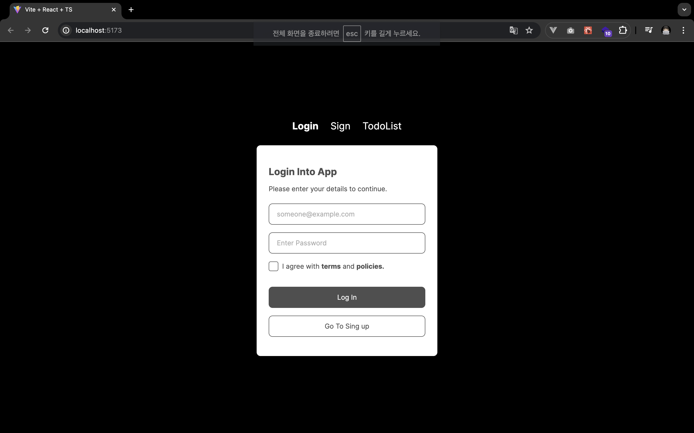
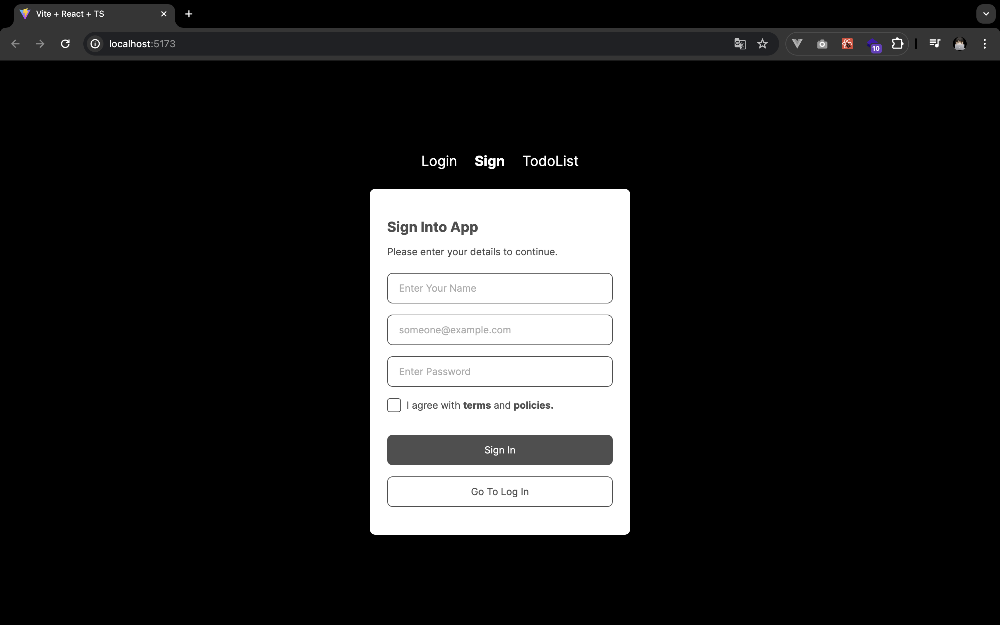
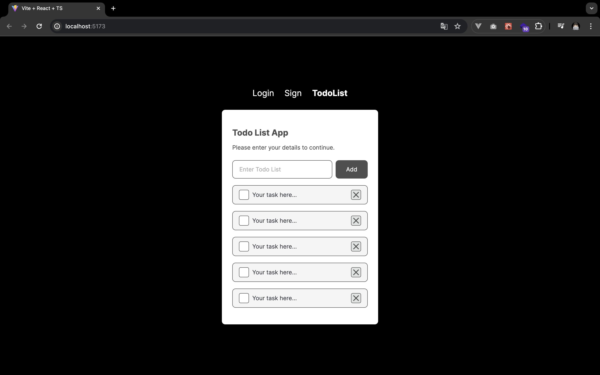

# 6일차 과제

## 🎯 과제 요구사항

- 학습한 CSS 스타일링 방법 중 한가지를 선택해서 로그인,회원가입,TodoList UI 퍼블리싱 작업

## 👩🏻‍💻 실습 과정

- TailwindCSS 선택

### 1. 디자인시스템 정의

피그마의 디자인 시안을 보고 color, border-radius, font-size 등을 확인하고 정의했다. 정의한 디자인시스템은 `tailwind.config,js` 파일내의 `theme` 사용

```javascript
export default {
  content: ['./src/**/*.{js,jsx,ts,tsx}'],
  theme: {
    extend: {
      colors: {
        primary: '#4F4F4F',
        secondary: '#35383E',
        third: '#ACACAC',
        black: '#000',
        white: '#FFF',
        opacity5: '#35383E0D',
        opacity10: '#35383E1A',
      },
      borderRadius: {
        sm: '0.4rem',
        md: '0.8rem',
      },
      fontSize: {
        md: '1.4rem',
        lg: '2rem',
      },
      fontFamily: {
        sans: ['Inter', 'sans-serif'],
      },
    },
  },
```

### 2. 컴포넌트 분리

디자인 시안에서 `중복된 영역`을 기준으로 컴포넌트 분리 작업

- Title.tsx
- TextField.tsx
- CheckBox.tsx
- Button.tsx
- Todo.tsx

### 3. 동적 Class 지정

공식문서와 구글링을 통해 동적으로 Class를 지정하는 방식을 찾아 적용해보았다.
`prop의 type`을 활용해 동적으로 적용 될 수 있도록 적용해보았다.

```jsx
export default function MainTitle({ children, type }: TitleProps) {
  const typeVariants: RecordType = {
    // 👈🏻
    main: 'text-lg font-bold mb-[1rem]',
    sub: 'text-md mb-[1rem] mb-[2rem]',
  };

  if (type === 'main') {
    return <h2 className={`text-primary ${typeVariants[type]}`}>{children}</h2>;
  }

  return <p className={`text-primary ${typeVariants[type]}`}>{children}</p>;
}
```

### 4. 중복으로 사용 될 Custom Class 정의

페이지별로 중복으로 필요한 Class들을 정의하는 방법을 찾아보았다. `tailwind.config.js`의 plugin을 custom 하는 방식으로 적용해 보았는데 해당 방식이 맞는건지 아직 의문이 드는 부분이 있다. 추가적인 공부가 필요해보인다고 생각했던 부분이다.

- 🔗 [참고](https://velog.io/@kcs0702/tailwind-custom-해서-사용하기)

```javascript
plugins: [
    ({ addUtilities }) => {
      addUtilities({
        '.bold': {
          '@apply font-bold': '', // 👈🏻 '' 빈값을 왜 할당해야 하는지 이유를 모르겠다...  공식문서에서 찾아보았으나, 아직 못찾았다.
        },
        '.section-wrapper': {
          '@apply w-[37.5rem] px-[2.5rem] py-[4rem] bg-white rounded-md': '',
        },
        '.form-wrapper': {
          '@apply flex flex-col gap-[1.6rem]': '',
        },
        '.btn-wrapper': {
          '@apply flex flex-col gap-[1.6rem] mt-[3.2rem]': '',
        },
        '.icon-line': {
          '@apply absolute top-[50%] left-[50%] translate-x-[-50%]  translate-y-[-50%] block w-[0.2rem] h-[1.8rem] bg-primary':
            '',
        },
      });
    },
  ],
```

### 5. CheckBox 커스텀

나는 주로 label 태그를 활용한 방식으로 CheckBox를 디자인 시안처럼 커스텀하는데, label 태그에 적용하려니, 너무 복잡해지는거 같아 방법을 찾아보니, checkbox 자체를 커스텀 하는 방식이 더 쉬워보여서 해당 방식으로 적용했다.

> Tailwind가 제공하는 `peer`이라는 속성이 있는데, 해당 속성을 이용하면 체크박스가 `checked`를 되었을 때 스타일링을 쉽게 적용할 수 있었다.

- 🔗 [참고](https://velog.io/@eunbi/tailwind로-checkbox-커스텀하는-방법)

```jsx
<input
  type="checkbox"
  id={`todo-${uuid}`}
  className={`appearance-none block w-[2.4rem] h-[2.4rem] border border-primary rounded-sm mr-[0.8rem] bg-white peer cursor-pointer`}
/>
<span
  className={`absolute top-[50%] left-[1.9rem] translate-y-[-50%] w-[1.6rem] h-[0.8rem] border-[0.3rem] border-black border-t-0 border-r-0 -rotate-45 origin-[25%_25%] mt-[0.2rem] hidden peer-checked:block`}
></span>
<label
  htmlFor={`todo-${uuid}`}
  className={`text-[1.4rem] text-secondary peer-checked:line-through cursor-pointer`}
>
  Your task here...
</label>
```

## 🤗 결과물

|               Login                |               Sign               |                 TodoList                 |
| :--------------------------------: | :------------------------------: | :--------------------------------------: |
|  |  |  |

## 🔥 과제 회고

Tailwind CSS 의 공식문서를 열심히 찾아보았고, 해당 프레임워크가 제공하는 기능을 최대한 활용해보고자 했다.
디자인 시스템인 Theme 정의하고, 자주 사용될거 같아보이는 부분은 custom class를 생성했으며 동적인 Class 적용도 시도해보았다. 아직 완벽하게 사용법을 익히지는 못해서 추가적으로 다른 프로젝트를 진행해보면서 더 시도해보려고 한다.
