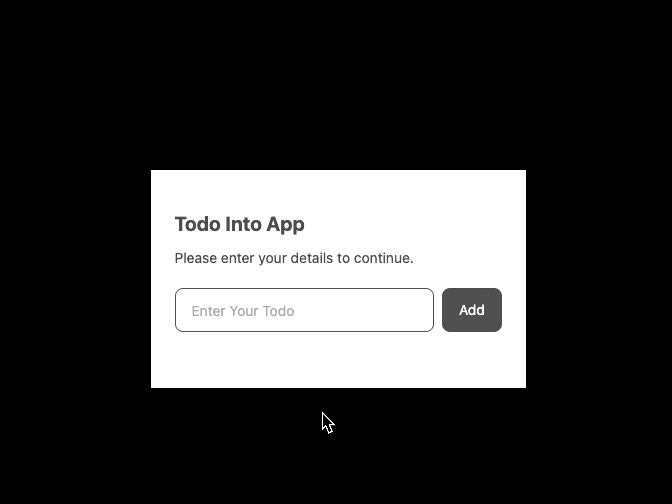
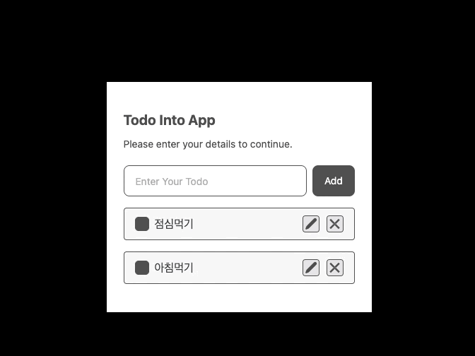
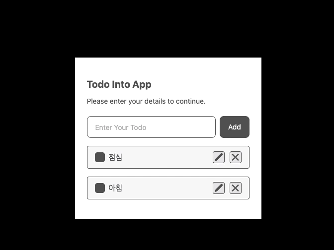

# 8일차 복습

## 🎯 학습 목표

- useReducer 와 contextAPI 를 활용한 TodoList 기능 구현 복습 + 최적화 적용
- 수정 버튼 기능 구현 추가 해보기

## 👩🏻‍💻 복습 과정

### 1. Type 정의

우선 사용할 Type들의 정의 했고, 컴포넌트 내에서 재사용 되므로 별도의 폴더내의 파일로 분리했다.

- Todo
- reducer 함수의 매개변수 action

```typescript
// todoType.ts

export type TTodo = {
  id: string;
  task: string;
  completed: boolean;
};

export type TAction = {
  type: 'ADD_TODO' | 'TOGGLE_TODO' | 'DELETED_TODO' | 'EDIT_TODO';
  payload: TTodo;
};
```

### 2. todoReducer 함수 생성

todoReducer 함수는 todos의 추가/토클/수정/삭제 순으로 상태변화에 필요한 로직을 case 별로 정의했다.
수정 버튼 기능 구현을 위해 action의 payload는 todo 요소를 할당 받는 로직으로 적용했다.

`dispatch(type : action , plaload : todo)`

```typescript
// todoReducer.ts

import { TAction, TTodo } from '../type/todoType';

export const todoReducer = (todos: TTodo[], action: TAction) => {
  switch (action.type) {
    case 'ADD_TODO':
      return [action.payload, ...todos];
    case 'TOGGLE_TODO':
      return todos.map((todo) =>
        todo.id === action.payload.id
          ? { ...todo, completed: !todo.completed }
          : todo
      );
    case 'EDIT_TODO': // 👈🏻 edit 로직 추가
      return todos.map((todo) =>
        todo.id === action.payload.id
          ? { ...todo, task: action.payload.task }
          : todo
      );
    case 'DELETED_TODO':
      return todos.filter((todo) => todo.id !== action.payload.id);
    default:
      return todos;
  }
};
```

### 3. ContextAPI를 활용한 todos, dispatch 함수 공급

#### 3-1. createContext 생성

createContext를 사용해 2개의 context 생성했다. **각각 공급하는 이유는 state(todos)와 dispatch 하나의 값으로 공급하게 되면 state(todos) 업데이트 함에 따라 값이 변경되면서 공급 받는(구독하고) 컴포넌트의 불필요한 리렌더링이 발생을 방지하기 위해서이다.**

- state
- dispatch

```jsx
const TodoStateContext = createContext<TTodo[] | null>(null);
const TodoDispatchContext = createContext<React.Dispatch<TAction> | null>(null);
```

#### 3-2. useContext를 사용하기 위한 CustomHook 생성

`useContext`는 전역으로 관리하는 상태를 사용할 컴포넌트에서 import 해서 사용해도 되지만, CustomHook으로 생성하여 Provider로 value를 전달하여 useContext를 사용 할 때, 잘못된 값을 전달할 경우의 error를 확인하기 위해 조건문을 추가를 하였고, return 문의로 상태와 dispatch 함수를 반환하였다.

- 🔗 [참고](https://velog.io/@defaultkyle/react-with-ts-2)

```jsx
export const useStateContext = () => {
  const todos = useContext(TodoStateContext);
  if (!todos) throw new Error('stateContext Error!');
  return todos;
};

export const useDispatchContext = () => {
  const dispatch = useContext(TodoDispatchContext);
  if (!dispatch) throw new Error('DispatchContext Error!');
  return dispatch;
};
```

#### 3-3. provider를 반환하는 별도의 컴포넌트 생성

`TodoContextProvider` 컴포넌트는 children 을 props로 전달받아 Context.Provider 컴포넌트들과 함께 렌더링 하는 역활을 한다.

> ⭐️ 학습을 통해 새롭게 알게 된 방식 <br/> 기존에는 별도의 최상위 컴포넌트 없이 Provider 컴포넌트를 아래와 방식으로 사용했다.

```jsx
const Todo = () => {
  return (
    <>
      <div className="w-[375px] bg-white py-10 px-6 text-[#4b4b4b]">
        <h1 className="text-xl font-bold mb-[10px]"> Todo Into App</h1>
        <p className="text-sm mb-5">Please enter your details to continue.</p>
        <TodoStateContext.Provider value={todos}>
          <TodoDispatchContext.Provider value={dispatch}>
            {/* 등록 */}
            <TodoEditor />
            {/* 리스트 */}
            <TodoList />
          </TodoDispatchContext.Provider>
        </TodoStateContext.Provider>
      </div>
    </>
  );
};
export default Todo;
```

> 🤔 학습을 통해 최상위 컴포넌트를 생성하고 props의 children로 감싸줄 컴포넌트를 전달 받아 사용한다. 이유가 궁금해서 공식문서를 찾아보니, 공급하는 Provider의 갯수가 추가되게 되면 코드 복잡해지니, 코드의 가독성 측면을 위해 사용하는 것이다. 굳이 이렇게 사용하지 않아도 된다. 그러나 확장을 생각한다면 해당 방법을 사용해도 될 것 같다.

- 🔗 [공식문서](https://react.dev/learn/scaling-up-with-reducer-and-context#moving-all-wiring-into-a-single-file)

```jsx
export const TodoContextProvider = ({ children }: { children: ReactNode }) => {
  const [todos, dispatch] = useReducer(todoReducer, []);

  return (
    <TodoStateContext.Provider value={todos}>
      <TodoDispatchContext.Provider value={dispatch}>
        {children}
      </TodoDispatchContext.Provider>
    </TodoStateContext.Provider>
  );
};
```

#### 3-4. TodoContextProvider로 공급받을 컴포넌트 감싸기

```jsx
// Todo.tsx
import { TodoContextProvider } from '../context/todoContext';

import TodoEditor from './TodoEditor';
import TodoList from './TodoList';

const Todo = () => {
  return (
    <>
      <div className="w-[375px] bg-white py-10 px-6 text-[#4b4b4b]">
        <h1 className="text-xl font-bold mb-[10px]"> Todo Into App</h1>
        <p className="text-sm mb-5">Please enter your details to continue.</p>
        <TodoContextProvider>
          {/* 등록 */}
          <TodoEditor />
          {/* 리스트 */}
          <TodoList />
        </TodoContextProvider>
      </div>
    </>
  );
};
export default Todo;
```

### 4. TodoEditor의 useDispatchContext 사용

useDispatchContext를 활용해서 dispatch 함수를 공급받아, 매개변수로 상태변화에 필요한 action 정의했다.

```jsx
const TodoEditor = () => {
  const [text, setText] = useState('');

  const dispatch = useDispatchContext(); // 👈🏻 dispatch 함수 공급

  const onChangeHandler = (e: React.ChangeEvent<HTMLInputElement>) => {
    setText(e.target.value);
  };

  const onSubmitHandler = (e: React.FormEvent<HTMLFormElement>) => {
    e.preventDefault();
    dispatch({
      // 👇🏻 상태변화 함수 action 정의
      type: 'ADD_TODO',
      payload: { id: uuidv4(), task: text, completed: false },
    });
    setText('');
  };
  return <>(....중략.....)</>;
};
export default TodoEditor;
```

### 5. TodoList의 useStateContext 사용해서 상태 조회

useStateContext를 통해 Todos를 조회하고, Todos 순회하여 리스트 UI 화면에 노출 처리

```jsx
import TodoListItem from './TodoListItem';

import { useStateContext } from '../context/todoContext';

const TodoList = () => {
  const todos = useStateContext(); // 👈🏻 todos 상태 조회
  return (
    <>
      <ul className="flex flex-col gap-4 mt-4">
        {todos &&
          todos.map((todo) => <TodoListItem key={todo.id} todo={todo} />)}
      </ul>
    </>
  );
};
export default TodoList;
```

### 6. TodoListItem의 useDispatchContext 사용

useDispatchContext를 활용해서 dispatch 함수를 공급받아, 토글버튼/삭제버튼을 구현하기 위해 각각 이벤트 핸들러에 dispatch 함수를 호출하고 매개변수로 상태변화에 필요한 action 정의했다.

```jsx
const dispatch = useDispatchContext();

const onInputChangeHandler = (e: React.ChangeEvent<HTMLInputElement>) => {
  setTask(e.target.value);
};

const onDeleteClickHandler = () => {
  dispatch({ type: 'DELETED_TODO', payload: todo });
};
```

### 7. 수정 버튼 기능 구현 추가 해보기

#### 기능 구현

- 토글에 따른 UI 변경
- 수정 버튼 클릭시 input 수정할 수 있는 input form 노출
- 변경할 수정사항 입력 후 버튼 클릭시 반영

```jsx
const [edit, setEdit] = useState(false);
const [task, setTask] = useState('');
```

input의 입력할 값을 관리할 task 와 수정버튼 클릭시 toggle 되는 UI 구현을 위해 2가지 상태 추가 작업

```jsx
const onInputChangeHandler = (e: React.ChangeEvent<HTMLInputElement>) => {
  setTask(e.target.value);
};

const onEditClickHandler = () => {
  setEdit(!edit);

  if (!edit) {
    setTask(todo.task);
  } else {
    setTask(task);
    dispatch({ type: 'EDIT_TODO', payload: { ...todo, task } });
  }
};
```

input Change 핸들러와 수정 버튼 Click 핸들러 함수 생성했고, input의 입력값이 변경 될 때마다 e.target.value를 사용해 화면을 업데이트 해주었고, 수정버튼 클릭시 setEdit boolean 값 변경을 통해 UI 변경되어 input form 노출될 수 있도록 수정했고, 조건문으로 수정된 변경사항이 반영되도록 dispatch 함수의 action을 정의했다.

<br/>

## 🤗 결과물

### 할일 추가



### 체크박스 토글



### 할일 삭제



### 할일 수정


<br/>

## 🔥 복습 회고

useReducer는 상태변화 함수를 컴포넌트 내부가 아닌 외부에서 관리 할 수 있다는 점에서 유용하다고 생각된다.
나중에 전역상태관리 라이브러리의 토대가 되는 개념이라서 (Redux, zustand) 익숙해지려고 여러번 TodoList를 만들어 보았다. 리액트는 단뱡향 흐르는 데이터 흐름을 가지고 있어, 상위 컴포넌트에서 하위 컴포넌트로 props를 통해 상태를 전달받는다. 그러나, 계층구조의 깊이감이 깊어지면 props의 전달에서의 불필요한 상황이 발생된다. Props Drilling 때문에 상태를 전역적으로 관리해야하는 필요성에 의해 React는 Context API를 제공해준다. 그러나 Context API는 최적화 작업도 함께 해주어야 한다.
Provider를 통해 공급해주는 상태가 변경된다면 Provider로 감싸고 있는 컴포넌트의 불필요한 렌더링 상황이 발생 될 수 있기 때문이다.
